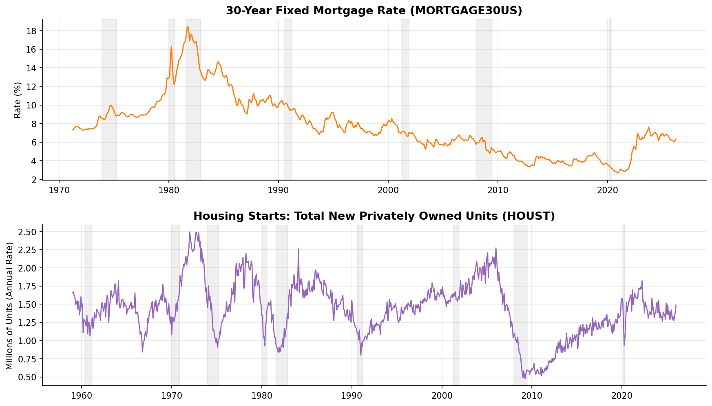
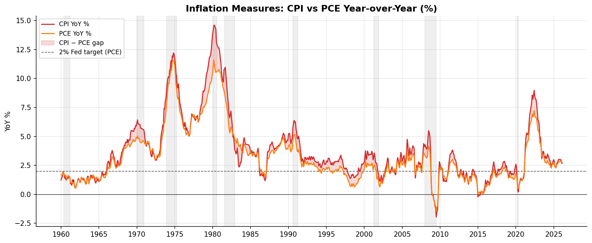
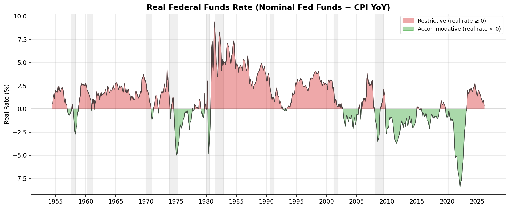

# FRED Public Data — Example Report

This report is generated from the `examples/` directory using live data pulled from the
[FRED public CSV endpoint](https://fred.stlouisfed.org/graph/fredgraph.csv) — no API key
required. Charts are produced by `scripts/generate_examples.py` and committed to the repo.

---

## Data Downloaded

| Series | Category | Description | Frequency | Unit | Start | End | Observations |
|--------|----------|-------------|-----------|------|-------|-----|-------------|
| `GDPC1` | national_accounts | Real GDP | Quarterly | Bil. Chained 2017 $ | 1947-01-01 | 2025-10-01 | 316 |
| `UNRATE` | labor_market | Unemployment Rate | Monthly | % | 1948-01-01 | 2026-03-01 | 938 |
| `PAYEMS` | labor_market | Nonfarm Payrolls | Monthly | Thousands | 1939-01-01 | 2026-03-01 | 1,047 |
| `CPIAUCSL` | prices | CPI All Urban Consumers | Monthly | Index 1982-84=100 | 1947-01-01 | 2026-03-01 | 950 |
| `PCEPI` | prices | PCE Chain-type Price Index | Monthly | Index 2017=100 | 1959-01-01 | 2026-02-01 | 806 |
| `FEDFUNDS` | interest_rates | Effective Federal Funds Rate | Monthly | % | 1954-07-01 | 2026-03-01 | 861 |
| `T10Y2Y` | interest_rates | 10Y-2Y Treasury Spread | Daily | % | 1976-06-01 | 2026-04-24 | 12,471 |
| `MORTGAGE30US` | housing | 30-Year Fixed Mortgage Rate | Weekly | % | 1971-04-02 | 2026-04-23 | 2,874 |
| `HOUST` | housing | Housing Starts: Total | Monthly | Thousands of Units | 1959-01-01 | 2026-01-01 | 805 |
| `USREC` | indicators | NBER Recession Indicator | Monthly | 0/1 | 1854-12-01 | 2026-03-01 | 2,056 |

**As of last refresh:** Real GDP $24.06T (Q3 2025) · Unemployment 4.3% · CPI YoY 3.3% (PCE 2.8%) ·
Fed Funds 3.64% · Real Fed Funds +0.32% (restrictive) · 10Y–2Y Spread +0.53% (normal) ·
Mortgage Rate 6.23% · Housing Starts 1.49M

Gray shaded bands on all charts mark NBER-defined recession periods.

---

## Real GDP


### What the data shows

The top panel plots the level of Real GDP — the inflation-adjusted value of all goods and
services produced in the United States — in trillions of chained 2017 dollars, running from
Q1 1947 through the most recent release. The bottom panel converts that level series into a
year-over-year growth rate by comparing each quarter to the same quarter one year prior. Green
bars indicate positive growth; red bars indicate contraction.

### Interpretation

**Long-run trajectory.** The near-unbroken upward slope of the level chart reflects the
productive capacity of the U.S. economy compounding over eight decades. Real GDP has grown
roughly 3× since 1980 and more than 7× since 1947 — with the 2017-dollar base providing a
clean apples-to-apples comparison across time.

**Business cycles are visible but modest.** Even the most severe post-war recessions appear
as brief dips on the level chart. The growth-rate panel makes their magnitude clearer: the
2008–09 Global Financial Crisis produced the deepest peacetime contraction since the Great
Depression (–4.0% YoY trough), while the COVID shock of 2020 briefly exceeded –9% — larger
in percentage terms but far shorter in duration thanks to rapid fiscal intervention.

**Post-COVID rebound and cooling.** The V-shaped recovery of 2020–2021 produced YoY growth
rates above +5%, reflecting both genuine demand recovery and base effects from the
2020 trough. By 2023–2024, growth had settled back toward the post-GFC norm of 2–3%, and
the most recent reading of +2.0% is consistent with trend growth but leaves little buffer
against further tightening or external shocks.

**Policy takeaway.** The Fed's dual mandate includes maximum employment *and* price
stability — the GDP trend gives context for both. Trend real GDP growth of ~2% is the
backdrop against which labor market slack and inflationary gaps are measured.

---

## Labor Market


### What the data shows

The top panel is the civilian unemployment rate — the share of the labor force that is
jobless and actively seeking work — reported monthly since January 1948. The bottom panel
shows the month-over-month change in total nonfarm payrolls (PAYEMS), the most-watched
jobs report headline. Blue bars represent job gains; red bars represent losses.

### Interpretation

**Structural downtrend in peaks.** Each successive recession has produced a lower unemployment
peak than the one before it, reflecting structural improvements in labor-market flexibility,
the expansion of automatic stabilizers, and more aggressive countercyclical policy. The 1982
recession peaked near 10.8%; the GFC peaked at 10.0%; COVID spiked to 14.7% in a single
month before reversing.

**The COVID anomaly.** April 2020's 14.7% print and the simultaneously catastrophic payroll
loss of ~20 million jobs in a single month stand apart from every other recession in the
dataset. The payrolls chart makes the speed of both the collapse and the recovery visually
dramatic: the bar chart effectively goes off-scale in both directions within a two-year
window. This episode illustrates that the business cycle can be driven by supply-side shocks
(forced closures) rather than demand, with a correspondingly faster recovery once the shock
passes.

**Pre-COVID tightness and post-COVID normalization.** The labor market entered 2020 at
a 50-year low unemployment rate of ~3.5%, supported by an uninterrupted 113-month payroll
expansion — the longest on record. The post-COVID recovery nearly matched that trough by
early 2023. The current reading of 4.3% is above the 2023 low but consistent with a
softening rather than a recessionary deterioration; the +178K monthly payroll gain is
still positive but has decelerated from the 400–500K monthly pace of 2021–2022.

**Payrolls as a coincident indicator.** The bar chart shows that payroll losses concentrate
tightly inside NBER recession bands (gray) and turn positive within a quarter or two of each
trough. This makes monthly payroll changes a near-real-time read on recession onset and exit
that complements the lagged GDP data.

---

## Inflation vs Federal Funds Rate


### What the data shows

The left axis (red) shows CPI year-over-year inflation — the percent change in the Consumer
Price Index for All Urban Consumers over the prior 12 months. The right axis (blue) shows
the effective federal funds rate, the Fed's primary policy instrument. The dashed line at 2%
marks the Fed's long-run inflation target, formally adopted in 2012. Fill shading indicates
whether CPI is above or below that target.

### Interpretation

**The Volcker disinflation (1979–1983).** The single most important episode in the chart is
the Fed's deliberate engineering of recession to break the 1970s inflation spiral. CPI peaked
near 14.8% in mid-1980. Fed Chair Paul Volcker raised the funds rate above 20% — a level that
would be politically and economically inconceivable today — triggering back-to-back recessions
(1980 and 1981–82) but successfully wringing inflation out of the system. By 1983, CPI had
fallen below 3% and the modern inflation-targeting era effectively began.

**The Great Moderation (1985–2020).** For 35 years, CPI YoY fluctuated almost entirely in a
0–5% band while the Fed ran a policy of preemptive gradualism — cutting rates ahead of
recessions and hiking modestly when inflation threatened. The GFC recession drove inflation
briefly negative in mid-2009 (an oil-price deflation artifact), but the near-zero Fed Funds
rate that followed kept inflation anchored rather than collapsing as in the 1930s.

**Post-COVID inflation surge (2021–2023).** The most significant peacetime inflation episode
since the 1970s began with reopening demand colliding with supply-chain disruption, then
sustained by tight labor markets. CPI peaked near 9.1% in June 2022. The Fed responded with
the fastest rate-hiking cycle since Volcker, raising the funds rate from 0–0.25% in March
2022 to 5.25–5.50% by mid-2023. The sequence mirrors the classic monetary policy transmission
lag: rate hikes work with a 12–18 month delay through credit markets and investment spending.

**Current state.** The March 2026 reading of 3.3% YoY — still above the 2% target — with
the Fed Funds rate at 3.64% suggests that easing has begun but policy remains modestly
restrictive. The gap between CPI and the target indicates the Fed has not yet declared
victory on inflation, though the 2022 peak is firmly in the past.

---

## Yield Curve


### What the data shows

The yield curve spread (T10Y2Y) is the daily difference between the 10-year and 2-year
U.S. Treasury constant-maturity yields, resampled here to monthly averages for visual
clarity. Green fill indicates a normal (upward-sloping) curve where long rates exceed short
rates; red fill indicates an inverted (downward-sloping) curve. Gray bands mark recessions.

### Interpretation

**Why the yield curve matters.** In a normal environment, investors demand a higher yield
for locking up capital for 10 years than for 2 years, producing a positive spread. When the
Fed hikes short-term rates aggressively while the market expects slower long-run growth and
eventual rate cuts, short-term yields rise above long-term yields — producing an inversion.
An inverted curve signals that bond markets believe current policy is restrictive enough to
cool the economy, and often materially slow loan growth as banks' net interest margins compress.

**Historical predictive record.** Every U.S. recession in the dataset was preceded by a
yield curve inversion. The lead time varies: the 2000 recession was preceded by inversion in
early 1998 (~2 years); the 2007–09 recession was preceded by inversion in mid-2006 (~18 months);
the brief 2020 recession was preceded by inversion in 2019 (~12 months). The relationship is
not mechanical — inversions have occurred without immediate recessions — but the signal has
been strong enough that the New York Fed publishes a formal recession probability model based
on it.

**The 2022–2024 inversion.** The Fed's rapid hiking cycle drove the spread deeply negative
through most of 2023 and into 2024, reaching a trough near −1.9% — the deepest inversion
since 1981. As of April 2026, the spread has re-steepened to +0.53%, consistent with the
Fed having begun cutting rates. Historically, the spread turns positive again shortly before
or during a recession as short rates fall faster than long rates (a "bull steepening"). The
current re-steepening therefore does not automatically signal all-clear — the question is
whether the economy has already absorbed the impact of the prior inversion or whether the
delayed effects are still working through credit channels.

**Structural context.** The secular decline in the long-run equilibrium real interest rate
(r*) since the 1980s means inversions can occur at progressively lower nominal rate levels.
The 2019 inversion reached barely −0.5% at its trough, yet still preceded a recession (even
if that recession was triggered by COVID). This argues for weighting the *direction* of the
spread change as much as the absolute level.

---

## Housing Market



### What the data shows

The top panel is the 30-year fixed mortgage rate (MORTGAGE30US), reported weekly by Freddie
Mac since 1971 and resampled here to monthly averages. The bottom panel is the monthly rate
of housing starts (HOUST) — new privately owned residential units begun — in millions of
units at a seasonally adjusted annual rate.

### Interpretation

**Mortgage rates as a direct transmission channel.** Unlike the Fed Funds rate, which affects
short-term borrowing, the 30-year mortgage rate is the primary cost lever for new home
purchases and has a near-immediate effect on housing demand. The two panels together show
the mechanical relationship: every sustained rate spike above the prior cycle's peak has
compressed housing starts within two to four quarters.

**The 1980s extremity.** Mortgage rates reached an all-time high of ~18.5% in October 1981
as Volcker's anti-inflation campaign pushed short-term rates above 20%. Housing starts
collapsed from above 2 million units in the late 1970s to barely 900,000 — a level not
matched until the trough of the 2008–09 housing bust. The subsequent decline in both
mortgage rates and inflation through the 1980s and 1990s underpinned a long secular boom
in residential construction and homeownership.

**The 2008–09 housing bust.** The housing crisis is visible in starts well before the GFC
recession: the collapse began in early 2006 from a peak near 2.3 million units, driven by
speculative overbuilding and tightening credit standards long before the broader financial
system froze. By April 2009, starts had fallen to an all-time low of ~478,000 units. The
slow recovery through the 2010s — despite historically low mortgage rates — reflected tight
lending standards, demographic headwinds, and builders' reluctance to add supply after the
bust.

**The 2022–2023 affordability shock.** The most recent episode is the sharpest mortgage-rate
increase in 40 years: rates rose from ~3% in early 2022 to over 7.5% by late 2023 — a pace
comparable to the Volcker shock in relative terms. Housing starts fell from ~1.8 million
units to roughly 1.3 million. The current rate of 6.23% and starts at 1.49M reflects a
partial recovery as the Fed has begun cutting rates, but affordability — the product of
elevated prices *and* elevated rates — remains near multi-decade lows.

**Supply constraint vs. rate sensitivity.** Post-COVID housing inflation was partly a
supply story: underbuilding through the 2010s left the U.S. roughly 3–5 million units short
of demographic need. This means that even if mortgage rates normalize, housing starts must
run above historical trend for an extended period to close the gap — a dynamic that limits
how much home prices can fall even in a restrictive rate environment.

---

## Inflation Measures: CPI vs PCE



### What the data shows

Both series are expressed as year-over-year percent changes. CPI (CPIAUCSL) measures the
price change of a fixed basket of goods and services for urban consumers. PCE (PCEPI) —
the Personal Consumption Expenditures chain-type price index — measures the prices of goods
and services consumed by households, using a chain-weighted formula that allows the basket
to adjust as consumers substitute between goods. The red fill shows periods where CPI runs
above PCE; the dashed line marks the Fed's 2% target.

### Interpretation

**Why the Fed prefers PCE.** The Federal Reserve formally targets PCE inflation, not CPI,
for three reasons: (1) PCE uses a spending-share-weighted basket that adjusts for
substitution (e.g., as beef prices rise, consumers buy more chicken — PCE captures that
shift; CPI does not); (2) PCE has broader coverage, including healthcare paid by employers
and government; (3) PCE has historically shown smaller upward revisions, making it a more
stable policy anchor. Understanding this distinction is essential for interpreting Fed
communications — when policymakers say "inflation is above target," they mean PCE, not CPI.

**The persistent gap.** CPI has historically run 30–50 basis points above PCE on average.
The gap narrows during recessions (when discretionary spending collapses) and widens during
supply shocks (when headline CPI jumps more than the broader consumption basket). The
April 2026 reading — CPI at 2.7% YoY vs. PCE at 2.8% YoY — shows the gap has temporarily
inverted slightly, partly because healthcare costs (which weigh more heavily in PCE) have
been running hot.

**The 2021–2023 surge in context.** Both measures peaked in 2022, but CPI's peak (~9.1%)
was several tenths above PCE's peak (~7.0%). The divergence was driven by the shelter
component of CPI, which lags actual rental market conditions by 12–18 months and produced
a much larger and more prolonged upward distortion in CPI than in PCE. This is one reason
the "last mile" of disinflation — getting from 3–4% down to 2% — appeared slower in CPI
headlines than in the PCE measures the Fed actually watches.

**Pre-COVID anchoring.** The period from roughly 2012 to 2020 is notable for both measures
running consistently below the 2% target. This "lowflation" regime, despite historically
accommodative monetary policy (near-zero rates plus quantitative easing), contributed to
the Fed's 2020 revision of its framework to "average inflation targeting" — explicitly
allowing inflation to run modestly above 2% to make up for prior shortfalls.

---

## Real Federal Funds Rate



### What the data shows

The real federal funds rate is computed here as the nominal effective federal funds rate
minus the CPI year-over-year inflation rate. Green fill indicates periods when the real rate
is negative (accommodative — the Fed is effectively subsidizing borrowing); red fill
indicates positive real rates (restrictive — the cost of borrowing exceeds the inflation
rate). Gray bands mark recessions.

### Interpretation

**Why the real rate matters more than the nominal rate.** A nominal rate of 5% is very
different at 2% inflation (real rate +3%, restrictive) versus 7% inflation (real rate −2%,
accommodative). The real rate is the actual "price" of money in terms of purchasing power,
and it governs investment and consumption decisions more directly than the headline rate
that dominates news coverage.

**Chronic accommodation (2009–2021).** After the GFC, the Fed held the nominal funds rate
near zero while inflation ran around 1–2%, producing mildly negative real rates throughout
the 2010s. This was deliberate: the Fed was attempting to stimulate an economy operating
below potential. The decade-long negative real rate contributed to compressed risk premia,
elevated equity valuations, and the search-for-yield behavior that inflated asset prices
across the board.

**The 2021–2022 policy error.** As inflation surged in 2021, the Fed initially left rates
near zero — producing the most deeply negative real rates since the 1970s (reaching nearly
−8% at the CPI peak). This was the most accommodative sustained policy stance in modern Fed
history, maintained well into a period of above-trend growth and labor market tightness.
Whether this was a forecasting failure (the Fed's "transitory" inflation call) or a
deliberate risk management choice remains debated, but the chart makes the magnitude of
the accommodation unmistakable.

**The 2022–2023 normalization.** The Fed's subsequent hiking cycle was exceptional not just
in pace but in real-rate terms: from −8% to positive territory within roughly 18 months.
The real rate crossed zero (i.e., became genuinely restrictive) in late 2022 and peaked
near +3% by mid-2023 — a level associated historically with significant credit tightening.
The current reading of +0.32% reflects easing that has returned the real rate to roughly
neutral, consistent with the Fed trying to achieve a soft landing rather than engineering
a sharp contraction.

**The Volcker comparison.** The 1979–1983 episode produced real rates above +8% — a level
that caused severe economic pain but permanently broke the 1970s inflation psychology. The
2022–2024 episode peaked much lower (~+3%) and has already begun unwinding. Whether that
level of restriction was sufficient to sustainably anchor inflation expectations at 2% is
the central unresolved question in the current environment.

---

## Cross-Series Relationships

The seven charts, read together, tell a coherent macro narrative:

1. **The policy cycle.** The nominal Fed Funds rate is the lever; PCE (not CPI) is the
   target; GDP growth and unemployment are the collateral effects. Every major rate-hiking
   cycle corresponds to a GDP deceleration or recession, typically with a 2–4 quarter lag.

2. **Real rates tell the true policy stance.** The nominal funds rate chart can be
   misleading: 5% rates in 1995 (real rate ~+3%) were restrictive; 5% rates in 2022
   (real rate ~−3%) were accommodative. The real rate chart is the correct frame for
   judging whether policy is actually tightening or loosening financial conditions.

3. **Yield curve as the transmission mechanism.** Yield curve inversion is how tight
   Fed policy propagates to the real economy: it compresses bank lending margins, raises
   long-term borrowing costs, and signals market skepticism about the growth outlook. The
   timing lag from inversion to recession (typically 12–24 months) explains why the Fed
   must act on leading indicators rather than waiting for GDP to turn negative.

4. **Housing amplifies rate cycles.** The mortgage rate chart shows that housing is the
   economy's most rate-sensitive sector — starts respond to rate changes faster and more
   severely than GDP. Housing often leads both into and out of recessions: it was the
   leading indicator of the 2008–09 GFC and was the first sector to slow in 2022.

5. **Labor markets are a lagging indicator.** Unemployment typically peaks 1–2 quarters
   *after* the GDP trough, and payrolls turn positive before unemployment fully recovers.
   A still-rising unemployment rate does not mean a recession is ongoing — it may signal
   the recovery is already underway.

6. **CPI vs PCE: watch what the Fed watches.** Because the Fed targets PCE, the CPI vs PCE
   chart explains the gap between inflation as the public experiences it (CPI headlines)
   and inflation as policymakers respond to it (PCE). The shelter-lagged CPI overshoot of
   2022–2023 made the "last mile" of disinflation appear slower than the Fed's own target
   series actually showed.

7. **Inflation is structurally sticky.** Neither CPI nor PCE responds immediately to rate
   hikes; transmission runs through credit conditions and wage-setting with 12–18 month
   lags. Both the Volcker episode and the 2022–2023 cycle show that the real rate must
   turn meaningfully positive — and stay there — before inflation reliably decelerates.

---

## Refreshing the Charts

```bash
# Re-fetch live data and regenerate all seven PNGs
python scripts/generate_examples.py

# Re-run the full notebook interactively
jupyter notebook explore.ipynb
```

All source code is in `scripts/generate_examples.py`.
The `explore.ipynb` notebook mirrors this analysis interactively.
