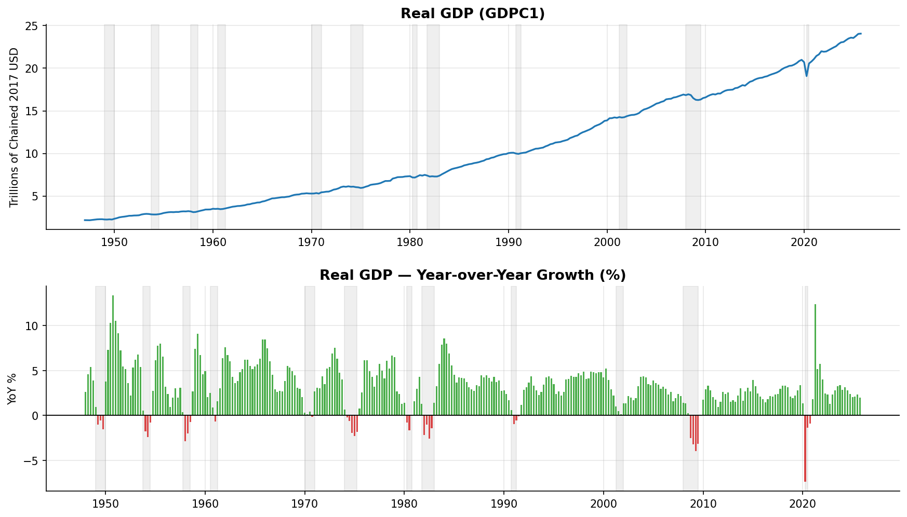
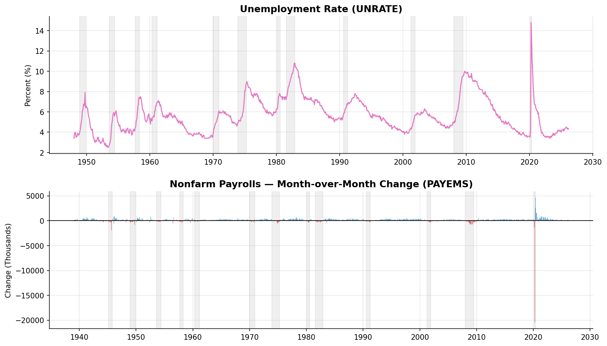
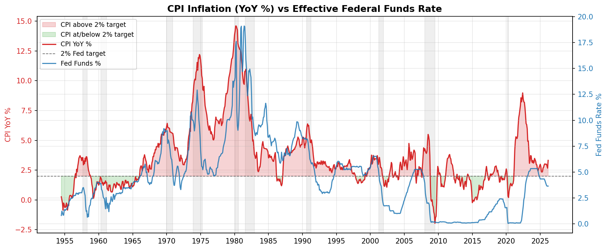
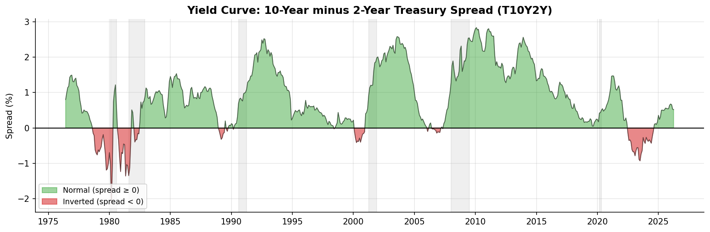

# FRED Public Data — Example Report

This report is generated from the `examples/` directory using live data pulled from the
[FRED public CSV endpoint](https://fred.stlouisfed.org/graph/fredgraph.csv) — no API key
required. Charts are produced by `scripts/generate_examples.py` and committed to the repo.

---

## Data Downloaded

| Series | Category | Description | Frequency | Unit | Start | End | Observations |
|--------|----------|-------------|-----------|------|-------|-----|-------------|
| `GDPC1` | national_accounts | Real GDP | Quarterly | Bil. Chained 2017 $ | 1947-01-01 | 2025-10-01 | 316 |
| `UNRATE` | labor_market | Unemployment Rate | Monthly | % | 1948-01-01 | 2026-03-01 | 938 |
| `PAYEMS` | labor_market | Nonfarm Payrolls | Monthly | Thousands | 1939-01-01 | 2026-03-01 | 1,047 |
| `CPIAUCSL` | prices | CPI All Urban Consumers | Monthly | Index 1982-84=100 | 1947-01-01 | 2026-03-01 | 950 |
| `FEDFUNDS` | interest_rates | Effective Federal Funds Rate | Monthly | % | 1954-07-01 | 2026-03-01 | 861 |
| `T10Y2Y` | interest_rates | 10Y-2Y Treasury Spread | Daily | % | 1976-06-01 | 2026-04-24 | 12,471 |
| `USREC` | indicators | NBER Recession Indicator | Monthly | 0/1 | 1854-12-01 | 2026-03-01 | 2,056 |

**As of last refresh:** Real GDP $24.06T (Q3 2025) · Unemployment 4.3% · CPI YoY 3.3% ·
Fed Funds 3.64% · 10Y–2Y Spread +0.53% (normal)

Gray shaded bands on all charts mark NBER-defined recession periods.

---

## Real GDP



### What the data shows

The top panel plots the level of Real GDP — the inflation-adjusted value of all goods and
services produced in the United States — in trillions of chained 2017 dollars, running from
Q1 1947 through the most recent release. The bottom panel converts that level series into a
year-over-year growth rate by comparing each quarter to the same quarter one year prior. Green
bars indicate positive growth; red bars indicate contraction.

### Interpretation

**Long-run trajectory.** The near-unbroken upward slope of the level chart reflects the
productive capacity of the U.S. economy compounding over eight decades. Real GDP has grown
roughly 3× since 1980 and more than 7× since 1947 — with the 2017-dollar base providing a
clean apples-to-apples comparison across time.

**Business cycles are visible but modest.** Even the most severe post-war recessions appear
as brief dips on the level chart. The growth-rate panel makes their magnitude clearer: the
2008–09 Global Financial Crisis produced the deepest peacetime contraction since the Great
Depression (–4.0% YoY trough), while the COVID shock of 2020 briefly exceeded –9% — larger
in percentage terms but far shorter in duration thanks to rapid fiscal intervention.

**Post-COVID rebound and cooling.** The V-shaped recovery of 2020–2021 produced YoY growth
rates above +5%, reflecting both genuine demand recovery and base effects from the
2020 trough. By 2023–2024, growth had settled back toward the post-GFC norm of 2–3%, and
the most recent reading of +2.0% is consistent with trend growth but leaves little buffer
against further tightening or external shocks.

**Policy takeaway.** The Fed's dual mandate includes maximum employment *and* price
stability — the GDP trend gives context for both. Trend real GDP growth of ~2% is the
backdrop against which labor market slack and inflationary gaps are measured.

---

## Labor Market



### What the data shows

The top panel is the civilian unemployment rate — the share of the labor force that is
jobless and actively seeking work — reported monthly since January 1948. The bottom panel
shows the month-over-month change in total nonfarm payrolls (PAYEMS), the most-watched
jobs report headline. Blue bars represent job gains; red bars represent losses.

### Interpretation

**Structural downtrend in peaks.** Each successive recession has produced a lower unemployment
peak than the one before it, reflecting structural improvements in labor-market flexibility,
the expansion of automatic stabilizers, and more aggressive countercyclical policy. The 1982
recession peaked near 10.8%; the GFC peaked at 10.0%; COVID spiked to 14.7% in a single
month before reversing.

**The COVID anomaly.** April 2020's 14.7% print and the simultaneously catastrophic payroll
loss of ~20 million jobs in a single month stand apart from every other recession in the
dataset. The payrolls chart makes the speed of both the collapse and the recovery visually
dramatic: the bar chart effectively goes off-scale in both directions within a two-year
window. This episode illustrates that the business cycle can be driven by supply-side shocks
(forced closures) rather than demand, with a correspondingly faster recovery once the shock
passes.

**Pre-COVID tightness and post-COVID normalization.** The labor market entered 2020 at
a 50-year low unemployment rate of ~3.5%, supported by an uninterrupted 113-month payroll
expansion — the longest on record. The post-COVID recovery nearly matched that trough by
early 2023. The current reading of 4.3% is above the 2023 low but consistent with a
softening rather than a recessionary deterioration; the +178K monthly payroll gain is
still positive but has decelerated from the 400–500K monthly pace of 2021–2022.

**Payrolls as a coincident indicator.** The bar chart shows that payroll losses concentrate
tightly inside NBER recession bands (gray) and turn positive within a quarter or two of each
trough. This makes monthly payroll changes a near-real-time read on recession onset and exit
that complements the lagged GDP data.

---

## Inflation vs Federal Funds Rate



### What the data shows

The left axis (red) shows CPI year-over-year inflation — the percent change in the Consumer
Price Index for All Urban Consumers over the prior 12 months. The right axis (blue) shows
the effective federal funds rate, the Fed's primary policy instrument. The dashed line at 2%
marks the Fed's long-run inflation target, formally adopted in 2012. Fill shading indicates
whether CPI is above or below that target.

### Interpretation

**The Volcker disinflation (1979–1983).** The single most important episode in the chart is
the Fed's deliberate engineering of recession to break the 1970s inflation spiral. CPI peaked
near 14.8% in mid-1980. Fed Chair Paul Volcker raised the funds rate above 20% — a level that
would be politically and economically inconceivable today — triggering back-to-back recessions
(1980 and 1981–82) but successfully wringing inflation out of the system. By 1983, CPI had
fallen below 3% and the modern inflation-targeting era effectively began.

**The Great Moderation (1985–2020).** For 35 years, CPI YoY fluctuated almost entirely in a
0–5% band while the Fed ran a policy of preemptive gradualism — cutting rates ahead of
recessions and hiking modestly when inflation threatened. The GFC recession drove inflation
briefly negative in mid-2009 (an oil-price deflation artifact), but the near-zero Fed Funds
rate that followed kept inflation anchored rather than collapsing as in the 1930s.

**Post-COVID inflation surge (2021–2023).** The most significant peacetime inflation episode
since the 1970s began with reopening demand colliding with supply-chain disruption, then
sustained by tight labor markets. CPI peaked near 9.1% in June 2022. The Fed responded with
the fastest rate-hiking cycle since Volcker, raising the funds rate from 0–0.25% in March
2022 to 5.25–5.50% by mid-2023. The sequence mirrors the classic monetary policy transmission
lag: rate hikes work with a 12–18 month delay through credit markets and investment spending.

**Current state.** The March 2026 reading of 3.3% YoY — still above the 2% target — with
the Fed Funds rate at 3.64% suggests that easing has begun but policy remains modestly
restrictive. The gap between CPI and the target indicates the Fed has not yet declared
victory on inflation, though the 2022 peak is firmly in the past.

---

## Yield Curve



### What the data shows

The yield curve spread (T10Y2Y) is the daily difference between the 10-year and 2-year
U.S. Treasury constant-maturity yields, resampled here to monthly averages for visual
clarity. Green fill indicates a normal (upward-sloping) curve where long rates exceed short
rates; red fill indicates an inverted (downward-sloping) curve. Gray bands mark recessions.

### Interpretation

**Why the yield curve matters.** In a normal environment, investors demand a higher yield
for locking up capital for 10 years than for 2 years, producing a positive spread. When the
Fed hikes short-term rates aggressively while the market expects slower long-run growth and
eventual rate cuts, short-term yields rise above long-term yields — producing an inversion.
An inverted curve signals that bond markets believe current policy is restrictive enough to
cool the economy, and often materially slow loan growth as banks' net interest margins compress.

**Historical predictive record.** Every U.S. recession in the dataset was preceded by a
yield curve inversion. The lead time varies: the 2000 recession was preceded by inversion in
early 1998 (~2 years); the 2007–09 recession was preceded by inversion in mid-2006 (~18 months);
the brief 2020 recession was preceded by inversion in 2019 (~12 months). The relationship is
not mechanical — inversions have occurred without immediate recessions — but the signal has
been strong enough that the New York Fed publishes a formal recession probability model based
on it.

**The 2022–2024 inversion.** The Fed's rapid hiking cycle drove the spread deeply negative
through most of 2023 and into 2024, reaching a trough near −1.9% — the deepest inversion
since 1981. As of April 2026, the spread has re-steepened to +0.53%, consistent with the
Fed having begun cutting rates. Historically, the spread turns positive again shortly before
or during a recession as short rates fall faster than long rates (a "bull steepening"). The
current re-steepening therefore does not automatically signal all-clear — the question is
whether the economy has already absorbed the impact of the prior inversion or whether the
delayed effects are still working through credit channels.

**Structural context.** The secular decline in the long-run equilibrium real interest rate
(r*) since the 1980s means inversions can occur at progressively lower nominal rate levels.
The 2019 inversion reached barely −0.5% at its trough, yet still preceded a recession (even
if that recession was triggered by COVID). This argues for weighting the *direction* of the
spread change as much as the absolute level.

---

## Cross-Series Relationships

The four charts, read together, tell a coherent macro narrative:

1. **The policy cycle.** The Fed Funds rate is the lever; CPI is the target; GDP growth and
   unemployment are the collateral effects. Every major rate-hiking cycle visible in the
   inflation chart corresponds to a GDP deceleration or recession visible in the GDP chart.

2. **Yield curve as the transmission mechanism.** The yield curve inversion is how tight
   Fed policy propagates to the real economy: it compresses bank lending margins, raises
   long-term borrowing costs, and signals market skepticism about the growth outlook. The
   timing lag from inversion to recession (typically 12–24 months) explains why the Fed
   must act on leading indicators rather than waiting for GDP to turn negative.

3. **Labor markets are a lagging indicator.** Unemployment typically peaks 1–2 quarters
   *after* the GDP trough, and payrolls turn positive before unemployment fully recovers.
   This means a still-rising unemployment rate is not evidence that a recession is ongoing —
   it may signal the recovery is already underway.

4. **Inflation is structurally sticky.** CPI does not respond immediately to rate hikes;
   the transmission runs through credit conditions and wage-setting with lags of 12–18
   months. Both the Volcker disinflation and the 2022–2023 episode show that significant
   restrictiveness must be sustained for multiple quarters before inflation reliably falls.

---

## Refreshing the Charts

```bash
# Re-fetch live data and regenerate all four PNGs
python scripts/generate_examples.py

# Re-run the full notebook interactively
jupyter notebook explore.ipynb
```

All source code is in `scripts/generate_examples.py`.
The `explore.ipynb` notebook mirrors this analysis interactively.
